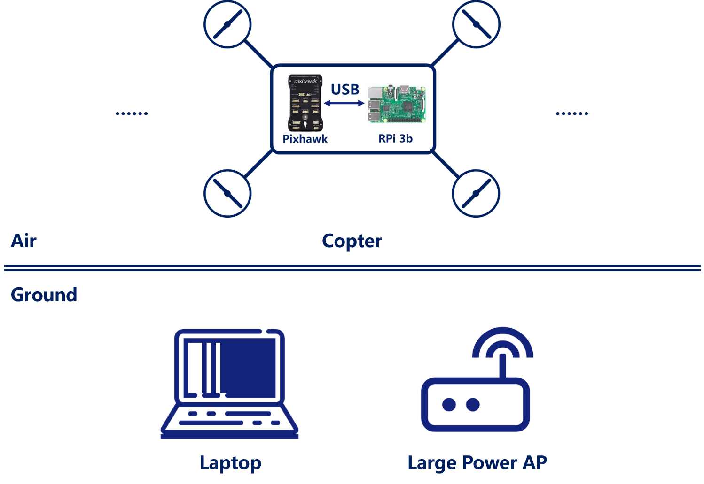
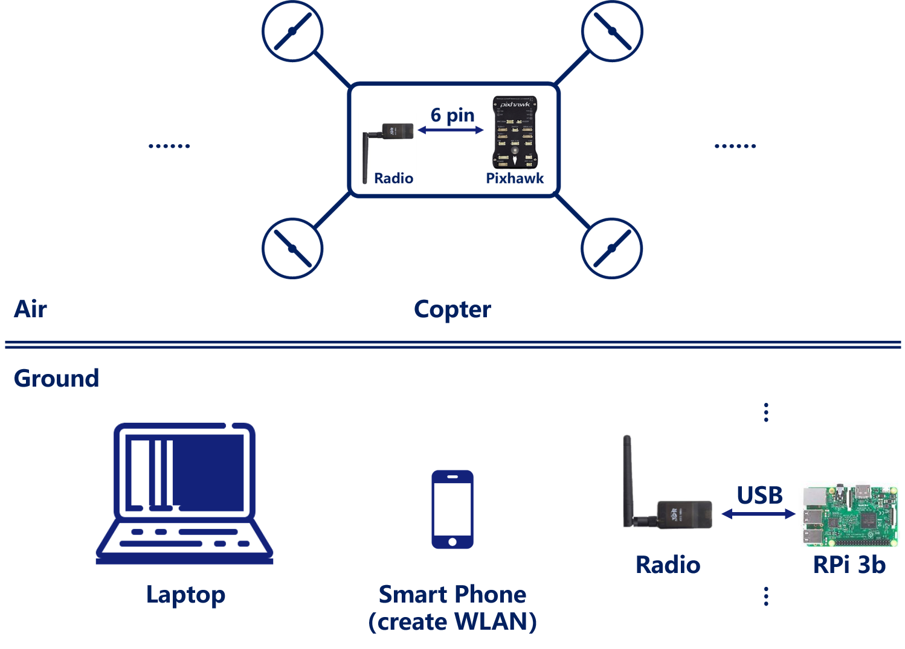

# Real Flight

Run CoUAV on real drone(s).

## Devices

* Laptop.
* ( RPi 3b + Mobile Power Pack + Drone + USB cable/SiK Telemetry Radio  ) * N.
* Large power AP ( No need if the RPi connects to the drone via radio since the WLAN  created  by a smart phone can satisfy the requirement ).

## Configuration

1. Firstly use git to download CoUAV and change current work directory on both laptop and RPi:

```
git clone https://github.com/whxru/CoUAV.git
cd CoUAV
```

2. Connect to RPi via SSH/VNC and make sure the laptop and RPi have connected to the same WiFi.

### Monitor on laptop

1. Install [Node.js](https://nodejs.org/en/)
2. Install Electron globally

```
npm install -g electron
```

Now you can build the application from the source:

```
electron Monitor/
```

### Script on RPi 

1. Enter RPi's command via SSH/VNC.
2. Uninstall MAVProxy if already installed:

```
pip uninstall MAVProxy
```

3. Download the MAVProxy source:

```
cd Pi/MAVProxy
git init .
git remote add origin https://github.com/ArduPilot/MAVProxy.git
git pull origin master
```

## Hardware Connection

### Option Ⅰ



### Option Ⅱ



## Start

Assume that current work directory on both RPi and laptop are the root of CoUAV's repo.

1. Run monitor on laptop:

```
electron Monitor/
```

2. Select a network interface and check public IPv4 address of the monitor via `Ctrl`+`H`,  press `Ctrl`+`N` to wait for a new connection.
3. Install the drone's battery and open the transmitter.
4. Check the port name of the radio on RPi (e.g. "ttyUSB0") :

```
ls /dev
```

5. Make RPi connect to the drone, note that the baudrate should be 57600 if the RPi connects to the drone via radio:

```
cd Pi/MAVProxy
python setup.py build install --user
cd MAVProxy
python mavproxy.py --master=/dev/ttyUSB0 --baudrate=115200 --moddebug=3 --load-module=mavnode
```

6. Establish the connection with monitor via the public IP (e.g. "172.20.10.5") after connecting to the drone:

```
node-connect 172.20.10.5
```

To connect to more drones, repeat step 2~6. Now you can perform tasks by choosing task files.

## Tips

* In outdoors, you can use SSH/VNC via ethernet cable.
* If you are in China now, you may need install electron with [cnpm](https://npm.taobao.org/).
* Due to the limit of map provided by [AutoNavi](https://lbs.amap.com/api/javascript-api/summary/), images out of China can not be loaded.
